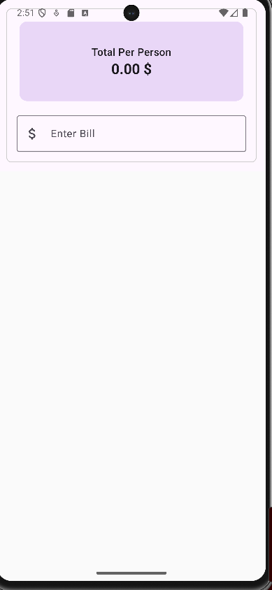
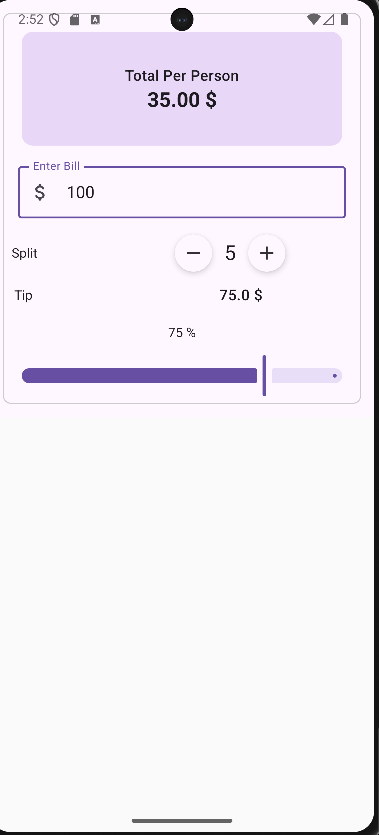

# 💰 TippingApp

**TippingApp** este o aplicație Android construită cu Jetpack Compose care ajută utilizatorii să calculeze rapid bacșișul și să împartă nota între mai multe persoane. Aplicația oferă o interfață intuitivă, interactivă și în timp real pentru gestionarea notelor la restaurant.

---

## 🧩 Funcționalități

- 📥 Introducerea sumei totale de plată
- ➕➖ Selectarea numărului de persoane care împart nota
- 🎚️ Slider pentru a seta procentul bacșișului (tip)
- 📊 Calcul automat:
  - Total bacșiș
  - Total de plată per persoană

---

## 📱 Interfață

### 📌 Ecran inițial (fără date introduse)

---

### 📌 Ecran după introducerea notei și ajustarea setărilor

---

## 🛠️ Tehnologii folosite

- Kotlin
- Jetpack Compose
- Android Studio

---

## 📚 Sursă de inspirație

Această aplicație a fost realizată ca parte a cursului de pe Udemy:

🔗 [The Complete Kotlin Android Jetpack Compose Developer Course](https://www.udemy.com/course/kotling-android-jetpack-compose-/?couponCode=PLOYALTY0923)

---

## 🔧 Structură aplicație

- `MainActivity.kt` – Logica principală și compunerea interfeței
- `InputField.kt` – Composable personalizat pentru câmpul de input
- `RoundIconButton.kt` – Butoane circulare personalizate pentru increment/decrement
- `util.kt` – Funcții pure pentru calculul bacșișului și al sumei pe persoană

---

## 📄 Licență

Distribuit sub licența [MIT].

---

> Made with ❤️ by Enache Victor in Kotlin & Jetpack Compose
